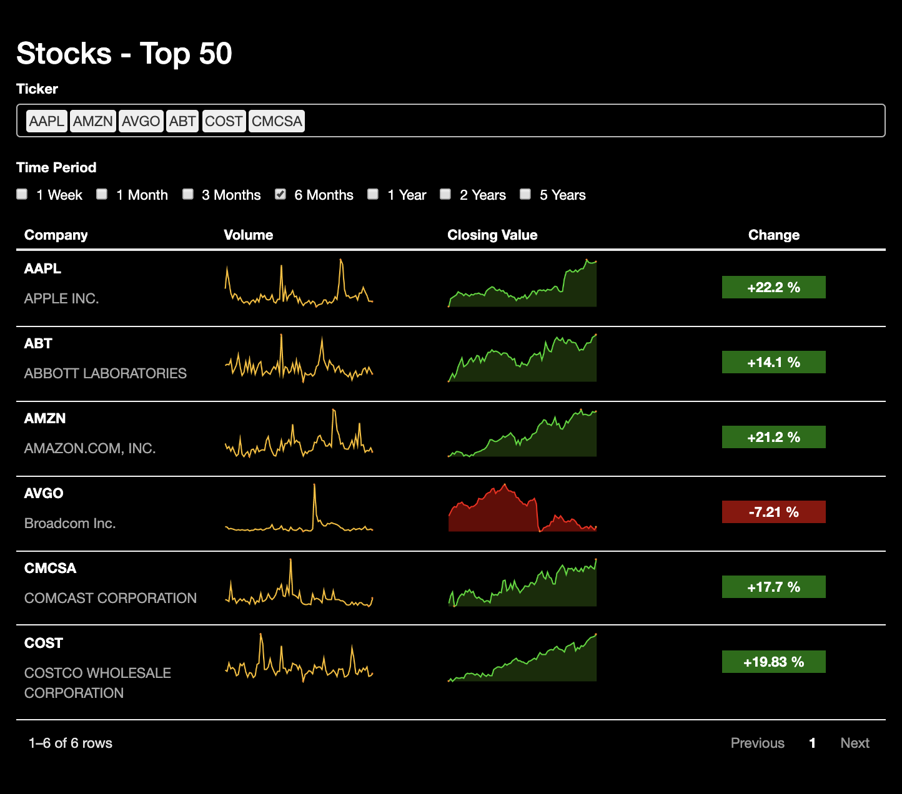

# Stock Table

This repo contains the code and assets used to generate a stock table submitted to the RStudio 2020 table [contest](https://blog.rstudio.com/2020/09/15/announcing-the-2020-rstudio-table-contest/). This particular table uses the [reactable](https://glin.github.io/reactable/) package to succinctly display historical stock data with options to choose a time lag as well as the specific companies to view.

## Table Preview

A preview of the table is shown below. It has options to include a subset of companies and lags.
 

