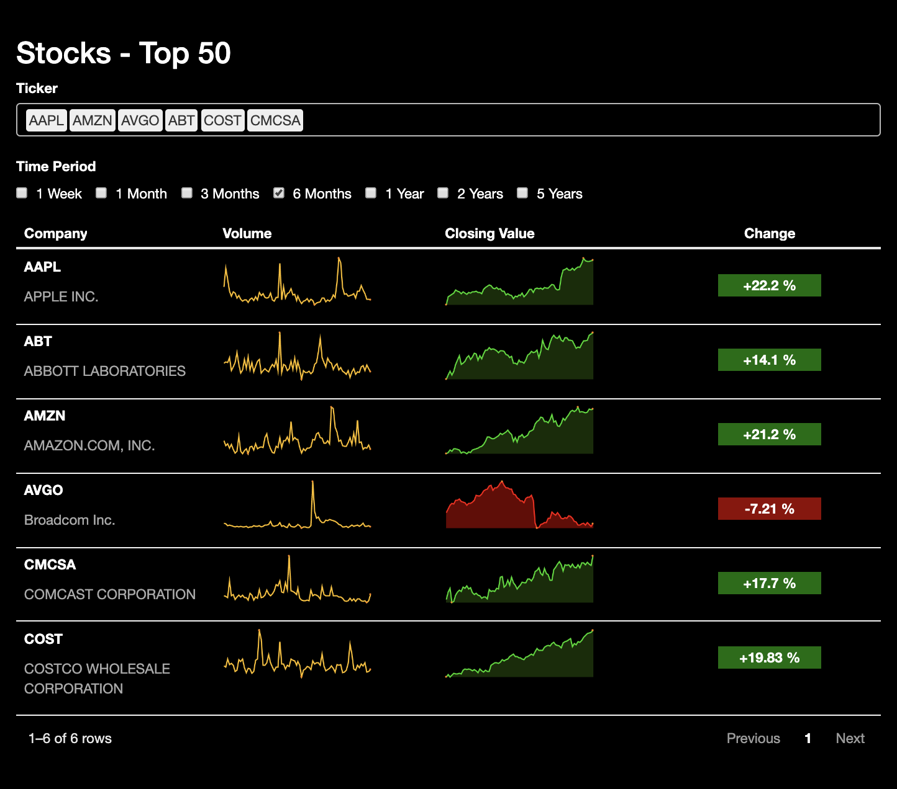

## About

This article covers the steps to create the stock table pictured below. The source data came from [kaggle](https://www.kaggle.com/ehallmar/daily-historical-stock-prices-1970-2018) and contains over 20 million rows! For the purposes
of this table, I limited this dataset to only the top 50 companies by market capitalization found [here](http://www.iweblists.com/us/commerce/MarketCapitalization.html) .
To get the source code and truncated data checkout the [github repo](https://github.com/rmwoody/stock-table)!



## Getting Started 
```{r, echo = FALSE}
include_code <- TRUE
explain <- TRUE
knitr::opts_chunk$set(echo = include_code, message = FALSE, warning = FALSE)
```

To get started, make sure that you have the following libraries installed:
```{r setup, include=FALSE}
library(distill)
library(reactable)
library(readr)
library(dplyr)
library(tidyr)
library(shiny)
library(crosstalk)
library(ggplot2)
library(lubridate)
library(sparkline)
library(stringr)
library(purrr)
```


## Stock Data

First, we will preview the stock data. For our table, we won't need anything further back than 6 years. Since the data goes back to the 1980's this will shrink the dataset substantially. Some rounding will also need to be done on the numeric columns.
To get a preview of the data, we can use `group_modify` to return a sample of data for each stock ticker.


```{r, include = explain}
stocks <- read_csv("./data/stocks.csv") 
min_date <- max(stocks$date) %m+% years(-6)

stocks <- 
  stocks %>% subset(date >= min_date) %>%
  mutate_if(is.numeric, ~round(.x,2))

preview <- 
  stocks %>% 
  group_by(ticker) %>% 
  arrange(desc(date)) %>% 
  group_modify(~head(.x,80))

reactable(preview,defaultPageSize = 7)
```

### Light Cleaning

Before creating any visuals, lets check that we have equal numbers of observations (days) for each ticker in the dataset. In this case, PayPal has a history less than the other tickers, so we will filter it out, leaving our "Top 50" as just at "Top 49".

```{r,include = explain}
# Verify the data is pretty clean
min(stocks$date)
stocks %>% 
  subset(date >= "2013-08-24") %>% 
  group_by(ticker) %>% 
  summarise(dates = length(unique(date)),
            first = min(date)) %>%
  arrange(dates) %>% 
  reactable(defaultPageSize = 7)
```

To get the stock names, we will read in a separate csv file. These are saved to a named vector which can be referenced in our table creation.

```{r, include = explain}
selected_stocks <- 
  read_csv("./data/top_50.csv") %>%
  mutate(Symbol = str_trim(Symbol))

stock_names <- selected_stocks$Name
names(stock_names) <- selected_stocks$Symbol
```

## Table Framework

This table will be using crosstalk to allow for filtering. The upside here is that the interactivity can be client side. The downside is that all the data must already be in the table, meaning that we can't reprocess the data when different lags are requested. For our data to work, we need a row for each lag, ticker, and day combination. The `expand` function does this handily.

```{r, include = explain}
lag_levels <- c("1 Month","3 Months","6 Months","1 Year","2 Years","5 Years")
framework <- 
  stocks %>% 
  ungroup() %>%
  mutate(lag = factor(rep("1 Month", nrow(.)), levels = lag_levels))%>%
  expand(ticker,lag) 
reactable(framework,defaultPageSize = 7)
```

## Date Ranges
The table is going to show history relative to a specific day. In this example, "2018-08-24" will be used.
The `convert_lag` function provides a consitent way to get lags based on a character input.

```{r}
convert_lag <- function(gdf,end_date){
  lag <- str_to_lower(unique(gdf$lag)[1])
  if (str_detect(lag,"week")){
    start_date <- end_date %m+% weeks(-1 * str_split(lag, " ")[[1]][1] %>% as.integer())
    } else if(str_detect(lag,"month")){
    start_date <- end_date %m+% months(-1 * str_split(lag, " ")[[1]][1] %>% as.integer())
    } else if(str_detect(lag,"year")){
    start_date <- end_date %m+% years(-1 * str_split(lag, " ")[[1]][1] %>% as.integer())
    }
  gdf$start_date <- rep(start_date,dim(gdf)[1])
  gdf
}
```


We can group the dataframe and apply `convert_lag` with `do` based on each lag in the dataframe. 
The created columns `volume_values` and `close_values` are nested lists that contain the entire series of both the dates and numeric values
for a ticker at a given lag. When building the table, these can be passed directly within the column definition to create a sparkline with closing values and their corresponding dates.


```{r,include = explain}

max_date <- as.Date("2018-08-24")

xf <- 
  framework %>% 
  left_join(preview, by = "ticker") %>% 
  group_by(lag) %>%
  do(convert_lag(.,max_date)) %>%
  subset(date >= start_date & date <= max_date) %>%
  arrange(ticker,lag,date) %>%
  ungroup() %>%
  group_by(ticker,lag) %>%
  summarise(volume_values = list(list("volume" = volume, "date"= date)),
            close_values = list(list("close" = close, "date"= date))) %>% 
  ungroup()
reactable(xf %>% head(5))
```


### Percent Changes

To calculate the percent change we can index the first and last element of the numbers stored under the `close` key in the nested lists within the `close_values` column.
 
```{r}

xf$change <-
  sapply(xf$close_values, function(x){
    round((pluck(x,"close") %>% tail(1) - pluck(x,"close")[1]) / pluck(x,"close")[1],4)
  })
```
## Sparkline Functions

To avoid making the table code overly long, we can define some functions to generate our sparklines. I'll confess that the styling took quite a bit of trial and error.

```{r}
close_sparkline <- function(nested_values){
  if (pluck(nested_values,"close")[1] >= tail(pluck(nested_values,"close"),1)){
    color = "red"
    fillColor = "#680000"
    } else{
    color = "#0ddd0d" 
    fillColor = "#193b05c4"
    }
  
  spk_composite(sparkline(pluck(nested_values,"close"),
                          height = "50px",
                          width = "150",
                          fillColor = fillColor,
                          type = "line",
                          lineColor = color,
                          lineWidth = 2,
                          chartRangeMin = min(pluck(nested_values,"close")),
                          chartRangeMax = max(pluck(nested_values,"close")),
                          tooltipFormatter = htmlwidgets::JS(
                            sprintf(
                              "function(sp, options, fld){debugger;return %s[fld.x] + '<br/>';}",
                              jsonlite::toJSON(
                                format(
                                  paste(pluck(nested_values,"close"),pluck(nested_values,"date"), sep = "<br>")
                                )
                              )
                            )
                          )
                        )
                      )
  }
```

### Volume Sparkline

```{r}
volume_sparkline <- function(nested_values){
  sparkline(pluck(nested_values,"volume"),
            height = "50px",
            width = "150",
            fillColor = "black",
            type = "line",
            lineColor = "#ffc00d",
            lineWidth = 2,
            chartRangeMin = min(pluck(nested_values,"volume")),
            chartRangeMax = max(pluck(nested_values,"volume"))
            )
  }
```


I've also included a function to style the percent changes.

```{r}
stock_delta <- function(value){
  if(value<0){
    tag_type <- "tag num-neg"
    } else if(value>0){
    tag_type <- "tag num-pos"
    } else if (value==0){
    tag_type <- "tag num-zero"
    }
  
  if(value<0){
    prefix <- "-"
    } else if(value>0){
      prefix <- "+"
    } else if (value==0){
      prefix <- " "
  }
  div(class = tag_type, paste0(prefix,100 * abs(value)," %"))
}

```

Some custom css is required for this table.

```{css,eval = FALSE}
.stock-charts {
  font-family: "Work Sans", "Helvetica Neue", Helvetica, Arial, sans-serif;
}

.selectize-input{
  background-color:black;
  border: 1px solid #b8b8b8;
}

.selectize-input > input {
  color:white;
}

.selectize-dropdown{
  background-color:#262626;
  color:#a7a7a7;
}

.selectize-input.full {
    background-color: black;
}

.selectize-input.input-active {
    background-color: black;
}

.selectize-control.single {
    background-color: black;
}

selectize-input input {
    color: #ffffff;
}

.num-pos {
    background-color: #006d00;
}

.num-neg{
    background-color: #910000;
}

.num-zero{
    color: hsl(121, 33%, 23%);
    background-color: hsl(121, 33%, 86%);
}

.tag {
    padding: 1px;
    font-weight: 600;
    color: white;
    width: 50%;
    margin-left: auto;
    margin-right: auto;
}
```


## Create The Table 

Now that all the hard work is done, all that is left is to call our functions and create the final table!
We will also do some styling within the creation of the HTML elements in addition to the css changes noted above.

```{r}

stock_theme <- reactableTheme(backgroundColor = "black", color = "white")
sdf <- SharedData$new(xf)

div(style = 'font-family: "Work Sans", "Helvetica Neue", Helvetica, Arial, sans-serif;background-color:black;color:white;padding:20px;',
    p("Stocks - Top 50",style = "font-size:28px;font-weight:bold;"),
    filter_select("ticker", "Ticker", sdf, ~ticker),
    filter_checkbox("lags", "Time Period", sdf, ~lag, allLevels = FALSE, inline = TRUE),
    reactable(sdf,
              theme = stock_theme,
              columns = list(
                ticker = colDef(
                  name = "Company",
                  width = 200,
                  cell = function(value){
                    list(p(value,style = "font-weight: bold;"),
                         p(purrr::pluck(stock_names,value),style = "color:#a8a8a8;margin: 0 0 3px;")
                    )
                    }
                  ),
                volume_values = colDef(
                  name = "Volume",
                  sortable = FALSE,
                  cell = function(values) {
                    volume_sparkline(values)
                  }
                  ),
                close_values = colDef(
                  name = "Closing Value",
                  sortable = FALSE,
                  cell = function(values) {
                    close_sparkline(values)
                  }
                  ),
                lag = colDef(show = FALSE),
                change = colDef(name = "Change",
                                align = "center",
                                style = "padding-top:25px",
                                cell = function(value){
                                  stock_delta(value)
                                }
                                )
                )
          )
    )

```

